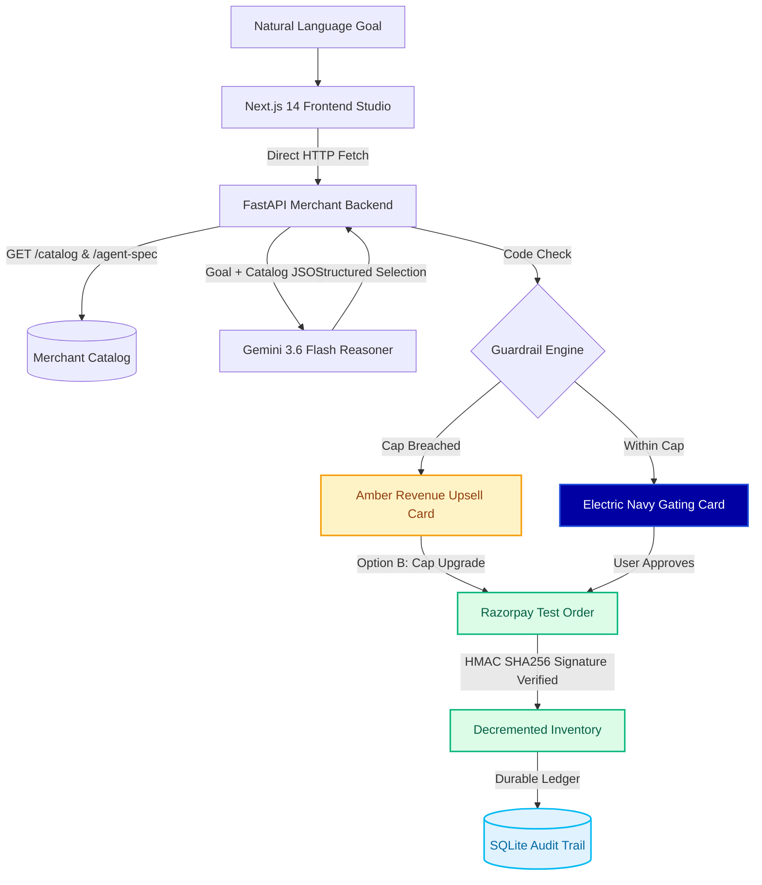

# 🍵 Boundly: Bounded Autonomous Agentic Commerce
> **Razorpay AI Buildathon — Track 01: AI Growth & Agentic Commerce**

<p align="left">
  
  
  
  
  
</p>

A production-grade, end-to-end implementation of an **Agent-Transactable Merchant** and an **Autonomous Buyer Agent**. Built using Next.js 14, FastAPI, Gemini 3.6 Flash LLM, Razorpay Test API, and a deterministic Code Guardrail / Human Gating Layer.

---

## 🎯 Project Objectives & What It Solves

### The Core Problem:
Autonomous AI agents are being given access to real bank cards and payment rails, but they are fundamentally **unbounded**:
1. **Financial Runaway:** LLMs hallucinate prices, miscalculate quantities, and can be prompt-injected into overspending.
2. **Fragile Commerce:** Agents crash or give up when an item is out of stock.
3. **Zero Oversight:** Transactions happen with no cryptographic paper trail or emergency stop mechanisms.

### What Boundly Solves:
Boundly bridges the trust gap between Generative AI and real Fintech. It transforms an unpredictable AI chatbot into a **bounded, compliant, production-grade autonomous buyer** that consumers and merchants can safely trust with real financial infrastructure (Razorpay):
* **Deterministic Guardrails:** Mathematical code-level spending caps (single-action & cumulative session limits) that LLM hallucinations cannot bypass.
* **Human-in-the-Loop Gating:** Explicit cryptographic human approval checkpoints before any real money moves.
* **Autonomous Resilience:** Recovers from stockouts via federated cross-merchant failover and smart revenue upsell proposals instead of crashing.
* **Durable Non-Repudiation:** An immutable SQL audit trail and an instant emergency kill switch to freeze rogue agents.

---

## 📌 Core Architecture & How Things Work

Most AI commerce hackathon projects build a simple **chat UI for humans** (e.g. a chatbot where a user asks for product recommendations and clicks a payment link). 

**Boundly proves genuine Agentic Commerce:**
1. **Agent-Readable Merchant API (`/agent-spec`)**: Exposes strict schema contracts, price standards in INR, stock reservation rules, and variant metadata so external autonomous software agents can browse, filter, and transact without human UI scraping.
2. **Independent Autonomous Buyer Agent**: A standalone buyer agent with **zero internal access or database privileges**. It communicates purely via REST API calls over HTTP.
3. **LLM Reasoning & Failover Engine**: Uses `gemini-3.6-flash` (with fallback to `gemini-3.5-flash` and `gemini-flash-latest`) for catalog reasoning and intent parsing. If LLM quota is exhausted, it fails over smoothly to a token-proximity NLP rule parser.
4. **Deterministic Guardrails Layer**: Confines the LLM strictly to catalog reasoning. The LLM **cannot** execute money-moving calls directly. All payments require passing a code-enforced spending cap (both single-action & cumulative session spend) and a human-in-the-loop gating checkpoint.
5. **Human Gating & Revenue Upsell Engine**:
   - **Navy Gating Card**: Presents transaction itemization, unit prices, and explicit **Agent Decision Rationale** before any money moves.
   - **Amber Revenue Upsell Card**: When a requested item or multi-unit quantity exceeds the spending cap, the agent dynamically generates **Option A** (in-budget alternative) and **Option B** (cap upgrade for requested quantity) for explicit human approval.
6. **Real Order Creation & Signature Verification**:
   - **Order Creation**: **100% Real** via Razorpay REST API (`POST /v1/orders` returning real `order_...` IDs).
   - **Payment Verification**: **Locally Simulated HMAC SHA256 Signature Verification** (`verification_mode: SIMULATED_TEST_SIGNATURE`).
7. **Durable Audit Trail**: Captures every decision step, reasoning trace, reasoning source (`GEMINI_3.6_FLASH` vs `RULE_FALLBACK`), guardrail check, and Razorpay Order ID into SQLite for 100% inspectability.

---

## 🏗️ System Workflow & Transaction Pipeline



---

## 🎬 Detailed Walkthrough of the 4 Core Scenarios

### 🍵 Scenario 1: Sleep Tea Purchase (Under ₹500 Cap)
> [!NOTE]
> **Electric Navy Gating Checkpoint (`#0000A3`) Active**  
> * **Goal:** `"I need a soothing herbal tea to help me sleep under ₹500"`  
> * **Initial Cap:** ₹500.00  
> * **Reasoning & Selection:** Evaluates catalog and selects `Himalayan Chamomile Lavender Infusion` (₹380.00, caffeine-free).  
> * **Human Gating:** Renders the Navy Gating Card with an **Agent Decision Rationale** box. Upon human approval (`Approve`), the agent calls Razorpay `/checkout/create-order`, verifies the payment signature, decrements stock, and presents a green receipt.

### 🍵 Scenario 2: Ceremonial Japanese Matcha Revenue Upsell (Cap Breach)
> [!WARNING]
> **Warm Amber Revenue Upsell Card (`#F59E0B`) Triggered**  
> * **Goal:** `"Buy Japanese Ceremonial Matcha Grade-A"`  
> * **Initial Cap:** ₹500.00 | **Item Price:** ₹950.00  
> * **Guardrail Check:** Hard spending cap breach detected before any checkout API call.  
> * **Dynamic Upsell Engine:** Instead of crashing, the agent generates an interactive proposal:  
>   * **Option A (In-Budget Alternative):** `1x Kashmir Kahwa Saffron Blend` (₹420.00).  
>   * **Option B (Cap Upgrade):** Upgrade session spending cap to **₹1000.00** and buy Matcha.  
>   * **Option C (Decline / Abort):** Abort request and log `USER_DECLINED` into audit trail.

### 🍵 Scenario 3: Multi-Item Bundle Purchase (Under ₹1,500 Cap)
> [!TIP]
> **Emerald Green Payment Execution (`#10B981`) Verified**  
> * **Goal:** `"Buy 1 Kahwa and 1 Darjeeling"`  
> * **Initial Cap:** ₹1,500.00  
> * **Bundled Items:** `1x Kashmir Kahwa Saffron Blend` (₹420.00) + `1x Imperial Darjeeling First Flush` (₹650.00) = **₹1,070.00**.  
> * **Guardrail Check:** ₹1,070.00 $\le$ ₹1,500.00 cap passed.  
> * **Itemized Checkout:** Navy Gating Card renders full multi-item subtotal breakdown. Single Razorpay order executed with HMAC SHA256 verified payment.

### 🍵 Scenario 4: Federated Store B Cross-Store Failover Recovery
> [!CAUTION]
> **Cyan Cross-Store Failover (`#00BAF2`) & Signal Red Emergency Stop (`#E24B4A`)**  
> * **Stockout Event:** Store A experiences a complete stockout of Kashmir Kahwa (`tea-001` stock = 0).  
> * **Autonomous Discovery:** Without user intervention, the buyer agent queries Federated Partner Store B (*Botanical Leaf Co.*) and finds `Pashmina Kashmiri Kahwa` (₹360.00).  
> * **Federated Gating Card:** Shows side-by-side comparison (Store A: 0 units ➔ Store B: 15 units in stock).  
> * **Emergency Kill Switch:** Toggling the Kill Switch in the sidebar activates a solid red `#E24B4A` glow ring and halts all autonomous operations instantly. Mid-transaction approval attempts are safely rejected and logged as `EMERGENCY_BLOCKED`.

---

## ⚡ Failure Handling & Defensive Security

| Status Event | Color Accent | HTTP Status | Logged Outcome | Description |
| :--- | :---: | :---: | :---: | :--- |
| **Payment Success** | `🟢 Emerald` | `200 OK` | `SIMULATED_TEST_SUCCESS` | Razorpay order created and HMAC SHA256 signature verified. |
| **User Denied** | `🔵 Navy` | `200 OK` | `USER_DENIED` | User clicked "Deny" at the human gating checkpoint. |
| **User Declined** | `🟠 Amber` | `200 OK` | `USER_DECLINED` | User clicked "Decline / Abort" on the revenue upsell card. |
| **Guardrail Blocked** | `🔴 Coral Red` | `400 / 200` | `BLOCKED_GUARDRAIL` | Single-action spending cap or session velocity hard-blocked. |
| **Emergency Halt** | `🔴 Coral Red` | `403 FROZEN` | `EMERGENCY_BLOCKED` | Merchant Kill Switch active; all carts and payments frozen. |

---

> **Tip:** You can capture screenshots from your browser at [`http://localhost:3000`](http://localhost:3000) and place them in an `assets/` folder in your repository.

| UI Component | Description | Screenshot Placeholder |
| :--- | :--- | :---: |
| **Agent Studio Dashboard** | Main chat interface with live reasoning traces & kill switch banner | `` |
| **Navy Gating Checkpoint Card** | Human-in-the-loop review card with Agent Rationale box | `` |
| **Amber Revenue Upsell Card** | Option A (In-Budget) vs Option B (Cap Upgrade) breach proposal | `` |
| **Federated Store B Failover Card** | Cross-store stockout discovery & failover card | `` |
| **Audit Trail Table** | Full SQL audit table displaying decision steps & Razorpay order IDs | `` |

---

## ⚡ Failure Handling & Security Resiliency

1. **Deterministic Spending Cap Enforcer:** Python code evaluates $\text{Amount} \le \text{Cap}$. The LLM cannot override this rule.
2. **Emergency Kill Switch:** Clicking the Kill Switch banner sets `AGENT_SYSTEM_HALTED = True`, freezing all autonomous transactions mid-flight.
3. **No Silent Fallbacks:** Every reasoning step explicitly logs whether it ran on `GEMINI_3.6_FLASH` or `RULE_FALLBACK`.

---

## 🚀 Quickstart & Running the Project

### 1. Install Python & Node Dependencies
```bash
pip install -r requirements.txt
cd frontend && npm install && cd ..
```

### 2. Configure Environment Variables
Copy `.env.example` to `.env`:
```ini
GEMINI_API_KEY=your_gemini_api_key
RAZORPAY_KEY_ID=rzp_test_your_key_id
RAZORPAY_KEY_SECRET=your_key_secret
SPENDING_CAP_INR=500.0
```

### 3. Launch Both Application Servers
```bash
python start_app.py
```
- **FastAPI Merchant Backend:** [`http://127.0.0.1:8000`](http://127.0.0.1:8000)
- **Next.js Dashboard UI:** [`http://localhost:3000`](http://localhost:3000)

### 4. Run Automated Scenario Test Suite
```bash
python scratch/test_all_scenarios.py
```
