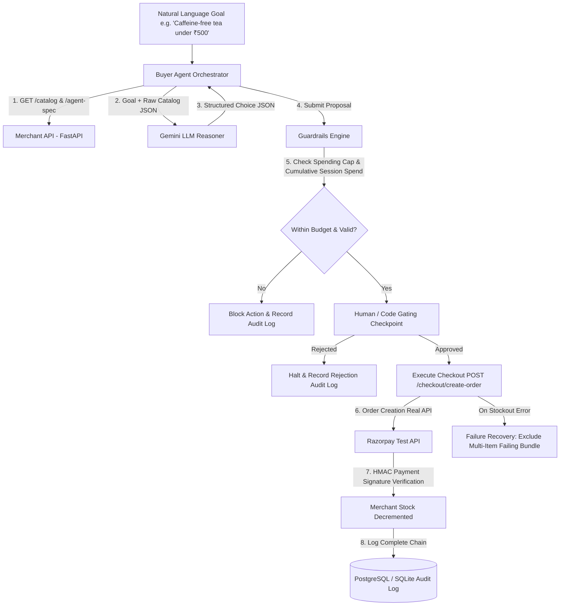

# 🍵 Agentic Commerce & Bounded M2M Payments
> **Razorpay AI Buildathon — Track 01 Submission: AI Growth & Agentic Commerce**

A production-grade, end-to-end implementation of an **Agent-Transactable Merchant** and an **Independent AI Buyer Agent**. Built on top of FastAPI, Gemini 3.6 Flash LLM, Razorpay Test API, and a deterministic Guardrails/Audit Layer.

---

## 📌 Problem Statement & Core Philosophy

Most AI commerce hackathon projects build a **chat UI for humans** (e.g. a chatbot where a user asks for product recommendations and clicks a payment link). 

This project proves **genuine Agentic Commerce**:
1. **Agent-Readable Merchant API**: Exposes strict schema contracts (`GET /agent-spec`), price standards (INR), stock reservation rules, and variant metadata so external autonomous software agents can browse, filter, and transact without human UI scraping.
2. **Independent Buyer Agent**: A standalone script with **zero internal access or database privileges**. It communicates purely via REST API calls over HTTP.
3. **Deterministic Guardrails & Gating Layer**: Confines the LLM strictly to intent parsing and catalog reasoning. The LLM **cannot** execute money-moving calls directly. All payments require passing a code-enforced spending cap (both single-action & cumulative session spend) and a human-in-the-loop gating gate.
4. **Transparent Order Execution & Simulation Architecture**:
   * **Order Creation**: **100% Real** via Razorpay REST API (`POST /v1/orders` returning real `order_...` IDs).
   * **Payment Capture & Verification**: **Locally Simulated HMAC SHA256 Signature Verification** (`verification_mode: SIMULATED_TEST_SIGNATURE`). *Note: In Razorpay's architecture, actual payment capture requires interactive hosted web/mobile UI card entry, which is out of scope for automated machine-to-machine API agents.*
5. **Durable Audit Log**: Captures every decision step, reasoning trace, reasoning source (`GEMINI_3.6_FLASH` vs `RULE_FALLBACK`), guardrail check, and Razorpay Order ID into PostgreSQL/SQLite for 100% inspectability.

---

## 🏗️ System Architecture



---

## 📁 Repository Structure

```
Track1/
├── merchant_api/           # Merchant REST API (FastAPI)
│   ├── app.py              # Server endpoints (/catalog, /cart, /checkout, /agent-spec)
│   ├── catalog.py          # Seed catalog ("Aura Artisan Teas & Botanicals")
│   ├── models.py           # Pydantic request/response schemas
│   └── razorpay_client.py  # Razorpay SDK integration for test orders & payment signatures
├── guardrails/             # Security Circuit-Breaker & Gating Layer
│   ├── engine.py           # Single-action & cumulative session spend validator
│   ├── gating.py           # Human-in-the-loop approval checkpoint & inventory warnings
│   └── audit.py            # Durable Audit Logger (SQLAlchemy DB models)
├── buyer_agent/            # Autonomous Buyer Agent
│   ├── agent.py            # Buyer agent core orchestrator & session spend tracking
│   ├── llm_reasoner.py     # Gemini 3.6 Flash LLM & Token-Proximity NLP parser
│   └── client.py           # Independent HTTP client for Merchant API
├── tests/                  # Automated integration test suite
│   ├── test_happy_path.py  # End-to-end successful purchase test
│   ├── test_guardrails.py # Spending cap breach rejection test
│   └── test_stockout.py    # Mid-checkout stockout recovery test
├── run_demo.py             # Rich CLI Interactive Demo Runner
├── app_streamlit.py        # Streamlit Web UI Dashboard
├── requirements.txt        # Python package dependencies
└── README.md               # Architecture documentation & pitch talking points
```

---

## 🔒 How Guardrails & Gating Work

1. **Spending Cap Enforcer (`guardrails/engine.py`)**:
   - Enforces single-action budget caps AND tracks cumulative session spending (`session_spent_inr`).
   - If an LLM recommends an item exceeding budget or breaching cumulative session caps, the Guardrail Engine instantly blocks execution with `BLOCKED_GUARDRAIL`.
2. **Human-in-the-Loop Gating Checkpoint (`guardrails/gating.py`)**:
   - Intercepts all authorized purchase proposals before any Razorpay API calls are made.
   - Displays a review panel showing product name, category, origin, flavor notes, price, variant, LLM reasoning, and inventory stock warnings.
   - Prompts for explicit approval (`[y/n]` in CLI mode or visual buttons in Web UI).
3. **Durable Audit Trail (`guardrails/audit.py`)**:
   - Stores every transaction step in `agentic_commerce.db` (or PostgreSQL).
   - Logged fields: `session_id`, `step_type`, `agent_goal`, `llm_reasoning`, `reasoning_source`, `spending_cap_inr`, `proposed_amount_inr`, `guardrail_passed`, `gate_status`, `razorpay_order_id`, `outcome_status`.

---

## ⚡ Failure Handling & Resiliency

1. **Multi-Item Stockout Recovery**:
   - If a product sells out between catalog browsing and checkout, the Merchant API returns `409 STOCKOUT_ERROR`.
   - The Buyer Agent catches the error, logs `STOCKOUT_RECOVERED`, excludes all products in the failing cart bundle, queries the catalog again for the next best matching item under budget, and completes checkout gracefully.
2. **No Silent Fallback Policy**:
   - Every reasoning decision explicitly logs its engine (`GEMINI_3.6_FLASH` vs `RULE_FALLBACK`).
   - Payment signatures explicitly record verification mode (`SIMULATED_TEST_SIGNATURE`).

---

## 🚀 Quickstart & Running the Demo

### 1. Install Dependencies
```bash
pip install -r requirements.txt
```

### 2. Configure Environment Variables
Copy `.env.example` to `.env`:
```ini
GEMINI_API_KEY=your_gemini_api_key
RAZORPAY_KEY_ID=rzp_test_your_key_id
RAZORPAY_KEY_SECRET=your_key_secret
DATABASE_URL=sqlite:///./agentic_commerce.db
SPENDING_CAP_INR=2000.0
GATING_MODE=CLI
```

### 3. Launch Web Dashboard UI
```bash
python -m uvicorn merchant_api.app:app --reload
```
Navigate to `http://127.0.0.1:8000/` for the bespoke Web UI.

### 4. Launch Interactive CLI Demo
```bash
python run_demo.py
```

### 5. Run Automated Test Suite
```bash
python -m pytest tests/
```

---

## 📽️ Pitch Video Talking Points (5-Minute Video Script)

1. **The Vision (0:00 - 1:00)**:
   - *"Most AI commerce projects build a chatbot for humans. We built a machine-transactable merchant and an independent AI agent that can buy products safely without human intervention."*
2. **Agent-Readable API (`/agent-spec`) (1:00 - 2:00)**:
   - *"Our merchant API exposes `/agent-spec` which tells autonomous agents currency standards (INR), pricing units, stock reservation limits, and required security gates."*
3. **The Differentiator: Guardrails & Gating (2:00 - 3:15)**:
   - *"LLMs are great at reasoning, but terrible at holding financial state. We strictly confine the Gemini LLM to intent parsing. The actual payment call can ONLY happen if code-level spending caps pass and explicit clearance is granted at our Gating Checkpoint."*
4. **Honest Architecture: Order API vs Payment Simulation (3:15 - 4:00)**:
   - *"Order creation is 100% real via Razorpay's REST API (`/orders`). Payment capture & signature verification is locally simulated with HMAC SHA256 since full checkout requires Razorpay's hosted checkout UI, which is out of scope for autonomous M2M API agents."*
5. **No Silent Fallback & Audit Trail (4:00 - 5:00)**:
   - *"We audit every failure path in our system so no call can silently masquerade as success. Every step logs its exact reasoning engine (`GEMINI_3.6_FLASH`) and verification mode in our durable SQL audit log."*
