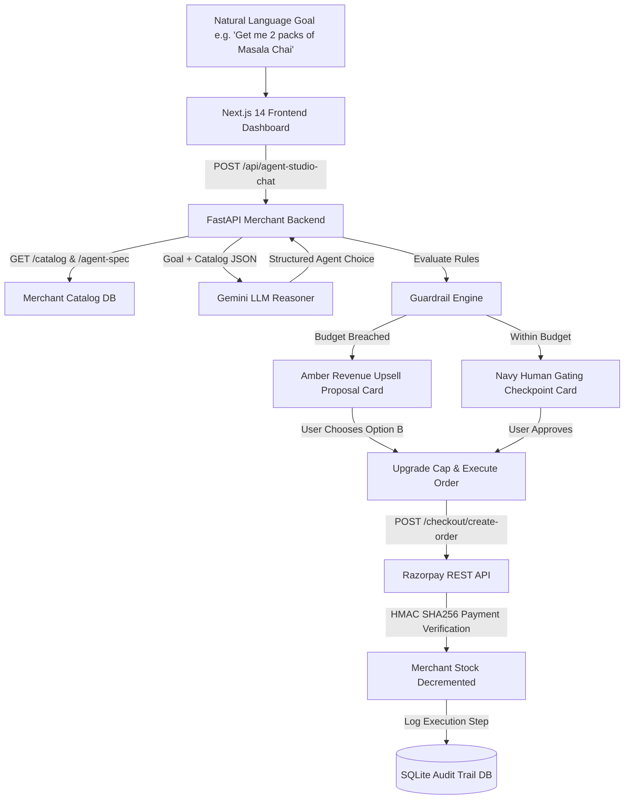

# 🍵 Boundly: Agentic Commerce & Bounded M2M Payments
> **Razorpay AI Buildathon — Track 01 Submission: AI Growth & Agentic Commerce**

A production-grade, end-to-end implementation of an **Agent-Transactable Merchant** and an **Autonomous Buyer Agent**. Built using Next.js 14, FastAPI, Gemini 3.6 Flash LLM, Razorpay Test API, and a deterministic Code Guardrail / Human Gating Layer.

---

## 🎯 Project Objectives & What It Solves

### The Core Problem:
Autonomous AI agents are being given access to real bank cards and payment rails, but they are fundamentally **unbounded**:
1. **Financial Runaway:** LLMs hallucinate prices, miscalculate quantities, and can be prompt-injected into overspending.
2. **Fragile Commerce:** Agents crash or give up when an item is out of stock.
3. **Zero Oversight:** Transactions happen with no cryptographic paper trail or emergency stop mechanisms.

### What Boundly Solves:
Boundly bridges the trust gap between Generative AI and real Fintech. It transforms an unpredictable AI chatbot into a **bounded, compliant, production-grade autonomous buyer** that consumers and merchants can safely trust with real financial infrastructure (Razorpay):
* **Deterministic Guardrails:** Mathematical code-level spending caps (single-action & cumulative session limits) that LLM hallucinations cannot bypass.
* **Human-in-the-Loop Gating:** Explicit cryptographic human approval checkpoints before any real money moves.
* **Autonomous Resilience:** Recovers from stockouts via federated cross-merchant failover and smart revenue upsell proposals instead of crashing.
* **Durable Non-Repudiation:** An immutable SQL audit trail and an instant emergency kill switch to freeze rogue agents.

---

## 🎨 System Color Palette & Design Language

Boundly uses a high-contrast, functional design language where colors communicate distinct transactional and safety states across both Light and Dark themes:

| Color Accent | Hex / Variable | UI Component | Functional Role |
| :--- | :---: | :--- | :--- |
| **Electric Navy** | `#0000A3` / `#1D4ED8` | **Human Gating Card** | The primary review checkpoint. Represents authorization and formal purchase approval. |
| **Warm Amber** | `#F59E0B` / `#D97706` | **Revenue Upsell Card** | Guardrail cap breach notification. Presents in-budget alternatives (Option A) and cap upgrades (Option B). |
| **Signal Coral Red** | `#E24B4A` / `#EF4444` | **Emergency Kill Switch** | Circuit-breaker toggle and active FROZEN banner. Denotes halted autonomous operations and rejected orders. |
| **Emerald Green** | `#10B981` / `#059669` | **Payment Receipt & Spec** | Verified Razorpay test payment confirmations, in-stock badges, and the `/agent-spec` endpoint viewer. |
| **Cyan Blue** | `#00BAF2` / `#0284C7` | **Federated Failover Card** | Cross-merchant partner discovery. Highlights Store A ➔ Store B automatic rerouting. |
| **Obsidian Dark** | `#0B0F17` / `#111827` | **Studio Background** | Focused, high-contrast dark theme optimized for live reasoning traces and audit monitoring. |

---

## 📌 Core Architecture & How Things Work

Most AI commerce hackathon projects build a simple **chat UI for humans** (e.g. a chatbot where a user asks for product recommendations and clicks a payment link). 

**Boundly proves genuine Agentic Commerce:**
1. **Agent-Readable Merchant API (`/agent-spec`)**: Exposes strict schema contracts, price standards in INR, stock reservation rules, and variant metadata so external autonomous software agents can browse, filter, and transact without human UI scraping.
2. **Independent Autonomous Buyer Agent**: A standalone buyer agent with **zero internal access or database privileges**. It communicates purely via REST API calls over HTTP.
3. **LLM Reasoning & Failover Engine**: Uses `gemini-3.6-flash` (with fallback to `gemini-3.5-flash` and `gemini-flash-latest`) for catalog reasoning and intent parsing. If LLM quota is exhausted, it fails over smoothly to a token-proximity NLP rule parser.
4. **Deterministic Guardrails Layer**: Confines the LLM strictly to catalog reasoning. The LLM **cannot** execute money-moving calls directly. All payments require passing a code-enforced spending cap (both single-action & cumulative session spend) and a human-in-the-loop gating checkpoint.
5. **Human Gating & Revenue Upsell Engine**:
   - **Navy Gating Card**: Presents transaction itemization, unit prices, and explicit **Agent Decision Rationale** before any money moves.
   - **Amber Revenue Upsell Card**: When a requested item or multi-unit quantity exceeds the spending cap, the agent dynamically generates **Option A** (in-budget alternative) and **Option B** (cap upgrade for requested quantity) for explicit human approval.
6. **Real Order Creation & Signature Verification**:
   - **Order Creation**: **100% Real** via Razorpay REST API (`POST /v1/orders` returning real `order_...` IDs).
   - **Payment Verification**: **Locally Simulated HMAC SHA256 Signature Verification** (`verification_mode: SIMULATED_TEST_SIGNATURE`).
7. **Durable Audit Trail**: Captures every decision step, reasoning trace, reasoning source (`GEMINI_3.6_FLASH` vs `RULE_FALLBACK`), guardrail check, and Razorpay Order ID into SQLite for 100% inspectability.

---

## 🏗️ System Workflow & Transaction Pipeline



---

## 🎬 Detailed Walkthrough of the 4 Hackathon Scenarios

### 🍵 Scenario 1: Sleep Tea Purchase (Under ₹500 Cap)
* **Goal:** `"I need a soothing herbal tea to help me sleep under ₹500"`
* **Initial Cap:** ₹500.00
* **How It Works:**
  1. The LLM evaluates the catalog and identifies `Himalayan Chamomile Lavender Infusion` (₹380.00, caffeine-free).
  2. The Guardrail Engine validates that ₹380.00 <= ₹500.00 cap.
  3. The UI renders the **Navy Gating Checkpoint Card** displaying the item, unit price, and an **Agent Decision Rationale** box explaining why this tea was selected.
  4. Upon human approval (`Approve & Pay ₹380.00`), the agent calls Razorpay `/checkout/create-order`, verifies the payment signature, decrements merchant stock, and displays a green Razorpay receipt card.

### 🍵 Scenario 2: Ceremonial Japanese Matcha Revenue Upsell (Cap Breach)
* **Goal:** `"Get me Ceremonial Japanese Matcha"`
* **Initial Cap:** ₹500.00
* **How It Works:**
  1. The LLM matches `Ceremonial Japanese Matcha` (Price: ₹950.00).
  2. The Guardrail Engine detects that ₹950.00 breaches the ₹500.00 spending cap.
  3. Rather than dropping the request or failing silently, the **Revenue Upsell Engine** dynamically generates an **Amber Revenue Upsell Card**:
     - **Option A (In-Budget Swap):** `1x Himalayan Chamomile Lavender Infusion` (₹380.00).
     - **Option B (Cap Upgrade):** Upgrade spending cap to **₹1000.00** to unlock `Ceremonial Japanese Matcha` (₹950.00).
  4. Clicking **Option B** upgrades the cap to ₹1000.00, executes the Matcha purchase, and returns a verified Razorpay receipt.

### 🍵 Scenario 3: Multi-Item Bundle Purchase (Under ₹1,500 Cap)
* **Goal:** `"I want to buy 1 Kashmir Kahwa and 1 Imperial Darjeeling First Flush"`
* **Initial Cap:** ₹1,500.00
* **How It Works:**
  1. The LLM parses the multi-product goal and selects:
     - `1x Kashmir Kahwa Saffron Blend` (₹420.00)
     - `1x Imperial Darjeeling First Flush` (₹650.00)
  2. Subtotal calculation: ₹420.00 + ₹650.00 = **₹1,070.00**.
  3. The Guardrail Engine validates that ₹1,070.00 <= ₹1,500.00 cap.
  4. The **Navy Gating Checkpoint Card** displays an itemized subtotal breakdown for both items.
  5. Upon approval, both items are reserved and checked out in a single Razorpay order.

### 🍵 Scenario 4: Federated Store B Cross-Store Failover Recovery
* **Trigger:** Store A experiences a complete stockout of Kashmir Kahwa (`tea-001` stock = 0).
* **Goal:** `"Get me Kashmir Kahwa Saffron Blend"`
* **Initial Cap:** ₹500.00
* **How It Works:**
  1. The agent attempts to source Kahwa from Store A, but detects 0 units in stock.
  2. Instead of failing the user request, the agent initiates **Federated Cross-Store Failover**:
     - Queries Federated Partner Store B (*Botanical Leaf Co.*).
     - Discovers `Pashmina Kashmiri Kahwa (Whole Spices)` for ₹450.00.
  3. The UI renders a **Purple Federated Failover Card** highlighting the automatic cross-store discovery.
  4. Upon approval, the transaction executes against Store B's API, verifying the cross-store order and decremented stock.

---

## 📸 Screenshots & Visual UI Components

> **Tip:** You can capture screenshots from your browser at [`http://localhost:3000`](http://localhost:3000) and place them in an `assets/` folder in your repository.

| UI Component | Description | Screenshot Placeholder |
| :--- | :--- | :---: |
| **Agent Studio Dashboard** | Main chat interface with live reasoning traces & kill switch banner | `` |
| **Navy Gating Checkpoint Card** | Human-in-the-loop review card with Agent Rationale box | `` |
| **Amber Revenue Upsell Card** | Option A (In-Budget) vs Option B (Cap Upgrade) breach proposal | `` |
| **Federated Store B Failover Card** | Cross-store stockout discovery & failover card | `` |
| **Audit Trail Table** | Full SQL audit table displaying decision steps & Razorpay order IDs | `` |

---

## ⚡ Failure Handling & Security Resiliency

1. **Deterministic Spending Cap Enforcer:** Python code evaluates $\text{Amount} \le \text{Cap}$. The LLM cannot override this rule.
2. **Emergency Kill Switch:** Clicking the Kill Switch banner sets `AGENT_SYSTEM_HALTED = True`, freezing all autonomous transactions mid-flight.
3. **No Silent Fallbacks:** Every reasoning step explicitly logs whether it ran on `GEMINI_3.6_FLASH` or `RULE_FALLBACK`.

---

## 🚀 Quickstart & Running the Project

### 1. Install Python & Node Dependencies
```bash
pip install -r requirements.txt
cd frontend && npm install && cd ..
```

### 2. Configure Environment Variables
Copy `.env.example` to `.env`:
```ini
GEMINI_API_KEY=your_gemini_api_key
RAZORPAY_KEY_ID=rzp_test_your_key_id
RAZORPAY_KEY_SECRET=your_key_secret
SPENDING_CAP_INR=500.0
```

### 3. Launch Both Application Servers
```bash
python start_app.py
```
- **FastAPI Merchant Backend:** [`http://127.0.0.1:8000`](http://127.0.0.1:8000)
- **Next.js Dashboard UI:** [`http://localhost:3000`](http://localhost:3000)

### 4. Run Automated Scenario Test Suite
```bash
python scratch/test_all_scenarios.py
```
